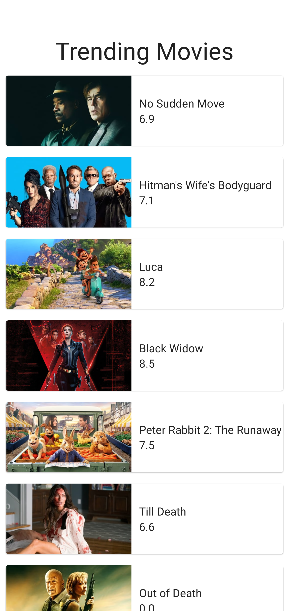

#  A Sample app to showcase using MVVM with JetPack Compose 

# This app showcases

The MovieDb trending movies list is used to showcase  https://developers.themoviedb.org/3/trending/get-trending
Jetpack Compose Usage with MVVM 

# Libraries used
                                   
Retrofit2 https://square.github.io/retrofit/
Coil https://google.github.io/accompanist/coil/
Navigation https://developer.android.com/jetpack/compose/navigation

# ScreenShots

